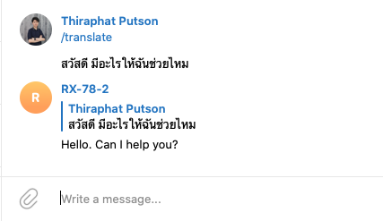

# telegram_bot_googletrans

telegram_bot for translate and other command

## Preview



## Installation

create venv with command

```bash
$ python3 -m venv ./venv
```

use venv with command

```bash
$ source venv/bin/activate
```

install requirement with command

```bash
$ pip install -r requirements.txt
```

add you token and run command

```bash
$ python telegram_bot.py
```

## Thank you!
